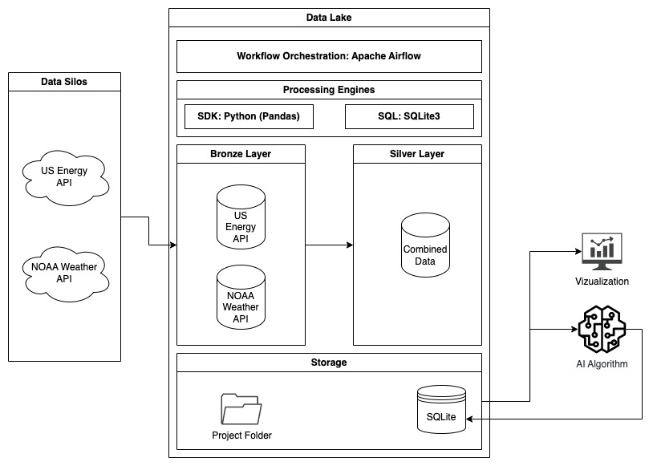

# Energy Consumption Prediction



## Table of Contents

- [Getting Started](#getting-started)
- [Dependencies](#dependencies)
- [Installation](#installation)
- [Usage](#usage)
- [Data](#data)
- [Notebooks](#notebooks)
- [Scripts](#scripts)
- [Models](#models)
- [Reports](#reports)
- [References](#references)

## Getting Started

To get started with the project, you'll need to navigate to your CLI and create a conda environment:
conda create -n energyvenv python=3.9.

NB: When running the apps, you need to change the os source in the top of all files to accommodate your environment.
eg. In bronze_layer.py:

```import pandas as pd
import json
import requests
import os
from datetime import datetime, timedelta
os.chdir("/Users/oanottage/Desktop/BTS/BDI/Final_Project/") <------- ONLY CHANGE the directory of your environment here, the rest of the program will work fine once you change only this.
```

(You must do this for all python files you wish to run.)

## Dependencies

The project relies on the following Python libraries:

- numpy
- pandas
- scikit-learn
- matplotlib
- seaborn
- sqlite3
- json
- pickle
- apache-airflow
- et. al

## Installation

To install the the dependencies of the project using pip:
pip install -r requirements.txt

## Usage

To use the project, run the flask application located in the /FlaskApp folder.
To execute the application after having changed the directory you can copy and paste this into the CLI:

```
cd FlaskApp
export FLASK=app.py
flask run
```

## Data

The data used in the project comes from the energy consumption data from the US Energy Information Administration and the weather data from NOAA.

## Notebooks

- `01-bronze.ipynb`: This notebook is an extended version of the bronze_layer.py script, that includes all the thoughts and decisions made to determine what is included in the script.
- `02-silver.ipynb`: This notebook is an extended version of the silver_layer.py script, that includes all the thoughts and decisions made to determine what is included in the script.
- `03-ML_Algorithm.ipynb`: This notebook contains an exploratory data analysis (EDA) and model selection, to determine the most favorable model for this project

## Scripts

- `bronze_layer.py`: This script collects data from the APIs and stores the raw formats into the Bronze Layer.
- `silver_layer.py`: This script combines the files from the bronze layer, saves it in .csv and .parquet formats, stores it into the Silver Layer, and does a dynamic entry into the EnergyWeatherDB database.
- `ETL.py`: This is the script that goes into the dag file of airflow. It calls the previous two scripts to collect preprocess and store the data.

## Databases

- `EnergyWeatherDB.db`: Located in /Data_Lake/Databases this information includes the combined Energy and Weather data. Over time as the algorithm pulls more data every day, the new data will be appended, for future research (ML) purposes

## Models

The model used in this project is a Random Forest Regressor with the following hyperparameters:

- n_clusters = 100

## Deliverables

- `app.py`: flaskapp with init.

## References

- https://www.eia.gov/opendata/qb.php?category=2122628
- https://www.ncdc.noaa.gov/cdo-web/webservices/v2
